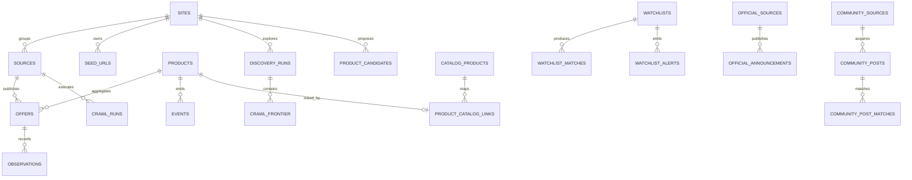

# Data Schema — SQLite

> 狀態：Active／As-built
> Current schema version：13. Migration 012 adds parser item/page totals; immutable migration 013 adds the separate `page_failed_count` required for page-failure SLOs.
> Source of truth：`src/db/migrations/*.sql`
> 最後更新：2026-07-28

## 1. Schema 管理規則

- Runtime 依三位數檔名順序執行 `001_...sql` 到 `013_...sql`；版本必須連續。
- 每個 migration 的 SHA-256 記錄在 `schema_migrations`；已記錄版本若 checksum 改變，啟動會拒絕升級。
- 每次 migration 使用 `BEGIN IMMEDIATE` transaction；成功後更新 `PRAGMA user_version`。
- DB 版本高於程式支援版本時，舊程式拒絕開啟。
- `src/db/schema.sql` 是早期初始 schema 參考；runtime migration chain 才是完整現況來源。
- 不修改已發布 migration。Schema 變更必須新增下一個連續版本的 `NNN_<name>.sql`，並同步更新本文件、測試、CHANGELOG、backup／restore compatibility。
- 所有應用 timestamp 使用 ISO-8601 UTC text；boolean 使用 SQLite integer `0／1`；結構化可變資料使用 JSON text。

## 2. 高階關聯

圖中只顯示主要 domain 關聯；完整表清單如下。

## 3. Migration 歷史

| Version | Migration | 主要變更 |
|---:|---|---|
| 1 | `001_initial_schema.sql` | Source、Product、Offer、Observation、Event、Notification、crawl run。 |
| 2 | `002_connector_versions.sql` | Connector／Recipe version。 |
| 3 | `003_sites_and_seeds.sql` | Site、Seed URL、user settings、source ownership。 |
| 4 | `004_discovery_review_queue.sql` | Discovery settings／run、Recipe、frontier、candidate queue。 |
| 5 | `005_catalog_i18n.sql` | Catalog、parts、evidence、aliases、terminology review、i18n offer fields。 |
| 6 | `006_offer_freshness_scheduler.sql` | Freshness lifecycle、monitor settings／requests。 |
| 7 | `007_watchlist_official_sources.sql` | Official registry／announcement／preview、Watchlist／match／alert。 |
| 8 | `008_community_intelligence.sql` | Community registry、posts、origin／link／match、run。 |
| 9 | `009_identity_exclusion_audit.sql` | Normalized SKU、variant key、listing exclusions。 |
| 10 | `010_manual_review_network_control.sql` | Product identity audit、exclusion review／override、network control。 |
| 11 | `011_operation_events.sql` | Local-first structured operation events（可觀測性）。 |
| 12 | `012_operation_event_counts.sql` | Parser valid／invalid／failed item 與 page count。 |
| 13 | `013_operation_page_failure_count.sql` | Parser page failure count。 |

## 4. Core commerce 與 event tables

### `sources`

一個可執行 Connector 的監控來源。重要欄位：

- Identity：`key` unique、`name`、`connector`、`connector_version`、`recipe_version`。
- Ownership：`site_id`、`managed_by`、`official_source_id`。
- Runtime config：`url`、`config_json`、`enabled`、`check_interval_seconds`。
- Health：`last_success_at`、`last_failure_at`、`last_error`、`consecutive_failures`。

`config_json` 不得保存 notification secrets。

### `products`

跨來源的商品身分。重要欄位：`name`、`brand`、`series`、`model`、`barcode`、`sku`、`normalized_sku`、`variant_key`、`release_date`、`image`、`catalog_product_id`。

Identity 規則：barcode／normalized SKU 優先；model 必須考慮 variant；缺乏可靠 evidence 時不可只靠 title 強制合併。

### `offers`

某 Source 對某 Product 的刊登，`UNIQUE(source_id,url)`。

- Listing：`title`、`price`、`currency`、`availability`、`confidence`、`purchasable`。
- Locale／tax：`availability_raw_text`、`availability_locale`、`price_tax_included`。
- 時間：`first_seen_at`、`last_seen_at`、`last_changed_at`。
- Freshness：`last_attempted_at`、`last_successful_at`、`fresh_until`、`freshness_status`、`consecutive_missing`、`archived_at`、`archive_reason`。
- Stability：`availability_candidate`、`availability_candidate_count`、`last_stable_at`。

### `observations`

每次取得的原始觀測。包含 `offer_id`、optional `crawl_run_id`、price／currency、observed availability、confidence、`raw_summary` 與 `observed_at`。`raw_summary` 超過 retention window 後清空，核心歷史欄位保留。

### `events`

穩定 transition 或首次發現的永久事件。包含 Product／Offer／Source reference、`type`、from／to state、price、message、`notified`、`created_at`。

Event type：`product_discovered`、`coming_soon`、`preorder_open`、`became_available`、`back_in_stock`、`out_of_stock`、`price_change`。

### `notifications`

每個 channel 的彙整傳送紀錄，`UNIQUE(channel,dedup_key)`。保存 Product、event IDs、title／body、status／detail 與時間，不保存 channel secret。

### `crawl_runs`

每次 source crawl 的可稽核結果：source、start／finish、status、items seen／excluded、events created、error。中斷後遺留 `running` row 會在下次啟動改為 `failed`。

## 5. Site、設定與 Discovery

| Table | 目的與關鍵 constraint |
|---|---|
| `sites` | 以 `registrable_domain` unique 表示網站；保存 display name 與 active／disabled status。 |
| `seed_urls` | Site 的 monitor／discovery 入口；`UNIQUE(site_id,canonical_url)`，source deletion 採 `SET NULL`。 |
| `user_settings` | Key／JSON value；語言、onboarding、privacy choices 等非秘密設定。 |
| `discovery_settings` | 每 Site 一筆；interval、page／depth／time／bytes／browser／concurrency／rate budget。 |
| `site_recipes` | 每 Site 一筆 versioned Recipe、status、JSON config 與 health。 |
| `discovery_runs` | Discovery execution／budget consumption／stop reason／error。 |
| `crawl_frontier` | 每 run 的 bounded queue；`UNIQUE(discovery_run_id,url_fingerprint)`。 |
| `product_candidates` | Review Queue；`UNIQUE(site_id,canonical_url)`，保存 confidence、reasons、listing evidence 及 review link。 |

Candidate 常見 status：`pending`、`approved`、`deferred`、`excluded`。Approve 後 `product_id`／`offer_id` 連到正式資料。

## 6. Catalog 與 terminology

| Table | 目的 |
|---|---|
| `catalog_products` | 正式商品號、generation／system／series、barcode、release、MSRP、verification 與 official source。 |
| `catalog_parts` | Blade、Ratchet、Bit、Assist Blade 等零件；type／code／canonical name 組成 unique identity。 |
| `catalog_product_parts` | Product 與 Part 的 many-to-many，保存 quantity／position。 |
| `catalog_evidence` | Entity 的 source URL、source type、locale、confidence、verification、license note 與摘要。 |
| `catalog_aliases` | 多語 alias 與 normalized alias；entity／locale／alias unique。 |
| `product_catalog_links` | 每 Product 最多一筆 Catalog link，保存 match method、confidence、reasons、verification。 |
| `terminology_review_queue` | 未知 availability／terminology 的原文、locale、context、suggestion 與 review status。 |
| `availability_term_overrides` | 經人工核准的 locale／normalized term → stable state mapping。 |

Verification status 應保留 `pending`、`verified`、`conflict` 等語意；零售商 evidence 不得自動提升為官方 verified。

## 7. Monitor 與 freshness

### `source_monitor_settings`

每 Source 一筆 monitor policy：base／min／max interval、freshness、jitter、backoff、archive misses、stability confirmations、manual cooldown、concurrency、minimum request interval、next run、failures。

### `monitor_requests`

手動立即重查 queue，status 使用 `queued` → `running` → completed／failed 類型；保存 requested／started／completed 時間與 detail。

Offer freshness status：

- `fresh`：最近成功觀測仍在有效期限。
- `stale`：已過期或成功掃描中缺失，不得顯示為可購買。
- `archived`：達 miss／terminal 條件，保留歷史；重新出現可恢復。
- `unknown`：尚無足夠 freshness 證據。

## 8. Official 與 Watchlist

| Table | 目的 |
|---|---|
| `official_sources` | Official store／news registry；預設 source 可保持 disabled。 |
| `official_announcements` | Canonical announcement、product code、event type、release／MSRP 等；source／URL／event unique。 |
| `official_scan_previews` | 首次掃描估算、scope、exclusions、budget、status 與 confirmation。 |
| `watchlists` | Rule／Catalog product／part target、model／barcode、keywords、exclusions、locale、match mode。 |
| `watchlist_notification_preferences` | Watchlist × event type enable flag。 |
| `watchlist_matches` | Match target、identity key、type、confidence、reasons；watchlist／identity unique。 |
| `watchlist_alerts` | Deduplicated alert；`dedup_key` global unique，optional links to official／Product／Offer。 |

## 9. Community intelligence

| Table | 目的與信任限制 |
|---|---|
| `community_sources` | Platform、profile、acquisition method、access state、budget、retention、filters；預設 disabled／zero budget。 |
| `community_posts` | 原文、locale、credibility、lead types、models、fingerprint、sensitive／spam／hidden、expiry；URL 與 source external ID unique。 |
| `community_post_origins` | 重貼／重複來源 provenance。 |
| `community_post_links` | Post 中的 canonical external links。 |
| `community_post_matches` | Post 與 Watchlist match；不可轉為 stock fact。 |
| `community_source_runs` | Acquisition run 與結果；與 retailer source health 隔離。 |

## 10. Audit、exclusion 與 network control

| Table | 目的 |
|---|---|
| `listing_exclusions` | 來源、URL、reason、raw summary、occurrence count、first／last seen 與 review status。`UNIQUE(source_id,url,reason)`。 |
| `listing_exclusion_overrides` | 對 source／URL 的 allow override 與 reason；unique source／URL。 |
| `product_identity_audit` | split／merge action、source／target／new Product、Offer IDs、before／after snapshots、note、time。刻意不使用 FK，避免刪除後失去 audit identity。 |
| `network_control` | Singleton `id=1`；UI network switch、reason、updated time。Environment hard lock 優先。 |
| `operation_events` | Local-first 可觀測性事件：`correlation_id`、`component`、`operation`、`source_key`（適用時）、`status`、`duration_ms`、bounded `error_class`、`valid_count`、`invalid_count`、`failed_count`、`page_count`、`page_failed_count`、`created_at`。Item invalid、item failed 與 page failed 永不合併計數；僅保留最近約 5000 筆；不含 credentials、完整 URL、log 內文或商品歷史。 |

## 11. Delete／retention 行為

- Product delete 會 cascade Offers、Observations 及部分 links；Event 的 Offer／Source 使用 `SET NULL` 以保留歷史。
- Source 的 UI「刪除」實際為 disable，不執行 DB hard delete。
- Community retention 會刪除過期 posts，child origin／link／match cascade。
- Raw observation summary 與 debug HTML 預設保留 72 小時；核心 observation 不因此刪除。
- Transfer bundle 包含 DB 與 sources，但不含 secret、PID、logs、raw debug HTML。
- Backup retention 預設 30 天且最多 30 份；以較先達條件者清理。

## 12. Schema 變更驗收清單

- 新增連續 migration，且全新 DB 與 legacy DB 升級測試通過。
- Foreign keys、unique constraints、indexes、delete behaviour 明確。
- 備份、還原、transfer、update rollback compatibility 已測試。
- API／UI 對 nullable／default／new status 有向前相容處理。
- 敏感資料與 retention impact 已審查。
- 更新本文件、Tech Spec、CHANGELOG、Ticket 與 PR Description。
