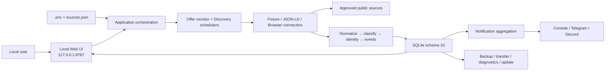
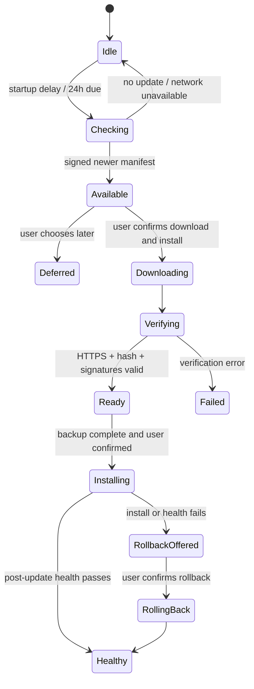

# Technical Specification — Beyblade Tracker

> 狀態：Active／As-built
> 對應版本：1.0.0、schema 10
> 最後更新：2026-07-28

## 1. 系統定位

Beyblade Tracker 是一個 local-first、single-user、single-node 應用程式。排程器、Web UI、資料擷取、事件判斷、通知及 SQLite storage 均運行在同一台電腦；外部連線只用於使用者核准的公開來源、選用通知 channel 及明確設定的更新來源。

## 2. 技術棧

| 層級 | 技術 |
|---|---|
| Runtime | Node.js 22+，ES modules |
| Database | Node 內建 `node:sqlite`／SQLite WAL |
| HTML parsing | `cheerio` |
| Browser acquisition | `playwright-core` + system Chrome |
| Web | Node `http` server、server-rendered HTML、vanilla JS |
| Test | `node:test` |
| Windows packaging | Inno Setup、bundled Node runtime、PowerShell／VBScript launcher |
| Notifications | Console、Telegram Bot API、Discord Webhook |

## 3. 架構



## 4. 元件責任

| 路徑 | 責任 |
|---|---|
| `bin/` | CLI entry points：crawl、worker、web、service、health、backup／restore、transfer、update／rollback。 |
| `scripts/service-control.js` | Windows-friendly start／restart／stop／status；只管理本專案 PID。 |
| `src/app.js` | 建立 app、同步來源、recover interrupted work、執行 monitor／discovery／notification／retention。 |
| `src/config.js` | 解析及驗證環境變數與來源設定；提供安全預設。 |
| `src/connectors/` | 統一 Listing contract；Fixture、JSON-LD／CSS、system Chrome acquisition。 |
| `src/core/normalize.js` | Unicode、URL、currency、price、model、barcode、SKU、variant、日期正規化。 |
| `src/core/classify.js` | availability state、confidence、purchasability 與排除規則。 |
| `src/core/pipeline.js` | Listing → Product／Offer／Observation／Event；穩定確認及 Catalog／Watchlist hook。 |
| `src/core/store.js` | 核心 persistence、crawl run、source health、identity 與 exclusion 寫入。 |
| `src/core/discovery.js` | Robots／Sitemap／Frontier／budget／Recipe 與候選產生。 |
| `src/core/review-queue.js` | Candidate approve／defer／exclude 及正式監控建立。 |
| `src/core/catalog.js` | Catalog、aliases、parts、evidence、terminology override。 |
| `src/core/monitor.js` | per-source schedule、jitter、backoff、freshness、missing／archive／recovery、manual check cooldown。 |
| `src/core/watchlist.js` | Watchlist match、notification preferences 與 alerts。 |
| `src/core/official.js` | Official source registry、preview、announcement 與 Catalog verification。 |
| `src/core/community.js` | Unverified community intelligence、dedup、filter、retention；與 stock facts 隔離。 |
| `src/core/identity-review.js` | Manual Product split／merge 與 before／after audit。 |
| `src/core/exclusion-review.js` | Exclusion confirm／allow／reopen 及 override。 |
| `src/core/network-control.js` | `.env` hard lock 與 DB UI switch 的合成狀態。 |
| `src/notify/` | channel adapters、HTTP resilience、aggregation、dedup 與 retry。 |
| `src/net/` | HTTP timeout、size limit、retry、rate limit、public URL／redirect validation。 |
| `src/web/` | Local UI、JSON API、CSRF、CSP 與 health endpoint。 |
| `src/maintenance/` | Consistent backup、restore、transfer、privacy-preserving diagnostics。 |
| `src/release/` | Release metadata、manifest signature verification、update staging／rollback。 |
| `src/security/secret-store.js` | Windows DPAPI CurrentUser notification secret storage。 |

## 5. 核心資料流

### 5.1 Offer monitor

1. `syncSources` 驗證並同步 `sources.json`；只有完整有效的設定才會停用已移除來源。
2. Scheduler 依 `source_monitor_settings.next_run_at` 選擇到期來源。
3. Network control 若為 disabled，停止 acquisition 與外部 notification，但保留 queue。
4. Connector 取得 Listing；單一來源 error 寫入 crawl run／source health 後繼續其他來源。
5. Pipeline 正規化、保守判斷 exclusion、解析 availability 與 identity。
6. 建立或更新 Product／Offer，寫入 Observation；狀態需達 stability confirmations 才成為 stable state。
7. `computeOfferEvents` 只為有效 transition 建立 Event；cooldown 抑制 flap。
8. Monitor 更新 `fresh_until`、missing count、archive／recovery 與下一次排程。
9. Notification queue 按 product／channel 彙整並送出；失敗 channel 保留 retry 狀態。
10. 清除 retention window 外的 raw summaries 與 debug HTML。

### 5.2 Discovery

1. 使用者先安全 preview URL，確認後建立 Site、Seed URL 及 Discovery settings。
2. Discovery 驗證 public URL、registrable domain、robots；優先 Sitemap，再使用有限 link frontier。
3. Run 受 pages、depth、seconds、bytes、browser pages、concurrency 與 minimum interval 限制。
4. Candidate 保存 confidence 與 reasons，進入 Review Queue。
5. 只有 approve 才建立 Product／Offer／monitor seed；defer／exclude 可後續重開。

### 5.3 商品身分

身分優先序為 barcode、normalized SKU、明確 model／variant。衝突 SKU、明確 edition／color 差異或不同 model 必須分開；缺少可靠識別資料時不以相似 title 強制合併。人工 split／merge 具有較高權威，後續 crawl 不得自動撤銷，所有操作寫入 `product_identity_audit`。

### 5.4 情報信任邊界

- Official announcement 可更新 Catalog，但衝突或低信心資料需 Review。
- Retail Offer 可建立價格／庫存 Observation 與 Event。
- Community post 永遠為 unverified clue；可 match Watchlist，但不可建立 Offer、official announcement 或 stock Event。

## 6. 執行模型

- `npm run service`／`start:tracker` 同時管理 worker 與 Web server。
- `npm run worker` 適合前景排程；`npm run web` 適合單獨 UI 除錯。
- Production-style 本機使用不得同時啟動多份 worker。
- PID、stop request 與 service status 在 `runtime/`；logs 在 `logs/`；兩者均不是 transferable data。
- SQLite 使用 `foreign_keys=ON`、`busy_timeout=5000`、檔案 DB 使用 WAL。

## 7. 設定

### 7.1 主要環境變數

| 分類 | 變數 | 預設／行為 |
|---|---|---|
| Storage | `DB_PATH`, `SOURCES_FILE`, `RAW_RETENTION_HOURS` | DB／source path；raw retention 預設 72h |
| Runtime | `RUNTIME_DIR`, `LOG_DIR`, `BACKUP_DIR` | 執行資料與備份位置 |
| Backup | `AUTO_BACKUP`, `BACKUP_INTERVAL_HOURS`, `BACKUP_RETENTION_DAYS`, `BACKUP_RETENTION_COUNT` | 預設啟用、24h、30d、30 copies |
| Web | `WEB_HOST`, `WEB_PORT` | `127.0.0.1:8787` |
| Behaviour | `PREORDER_PURCHASABLE`, `EVENT_COOLDOWN_SECONDS`, `PRICE_CHANGE_THRESHOLD`, `OFFER_STABILITY_CONFIRMATIONS` | 預設 false、21600s、5%、2 confirmations |
| HTTP | `HTTP_TIMEOUT_MS`, `HTTP_MAX_RETRIES`, `HTTP_PER_HOST_INTERVAL_MS`, `HTTP_USER_AGENT` | 預設 15s、3、2s |
| Safety | `NETWORK_ENABLED` | `0` 是 UI 無法覆寫的 hard lock |
| Debug | `DEBUG_HTML`, `DEBUG_HTML_DIR` | 預設不保存 HTML |
| Notification | `TELEGRAM_BOT_TOKEN`, `TELEGRAM_CHAT_ID`, `DISCORD_WEBHOOK_URL` | 空白即停用；Windows UI 可改用 DPAPI |
| Update | `UPDATE_MANIFEST_URL`, `UPDATE_PUBLIC_KEY` | 未設定即無正式 online update |

### 7.2 Source contract

每個 source 必須有 unique `key`、合法 `connector`、至少 60 秒 interval 及 connector-specific config。`fixture` 需 file／frames／listings；`jsonld` 與 `browser` 需至少一個 HTTP(S) product page。Connector 回傳的 Listing 至少應能提供 URL 與可識別商品的 title／structured fields，並遵守 semantic connector version。

## 8. Security 與 privacy

- Web server 預設 loopback；request Host 只接受 `127.0.0.1`、`localhost`、`[::1]`。
- 所有 POST／PATCH／PUT／DELETE 要求同源 Origin（若存在）及 `X-CSRF-Token`。
- Response 設定 `no-store`、`nosniff`、same-origin referrer policy、CSP 與 `frame-ancestors 'none'`。
- URL acquisition 阻擋 local／private address，且每次 redirect 重新驗證。
- HTTP 具有 timeout、response size、retry、rate limit；per-source interval 只能提高全域禮貌性限制。
- Secrets 不進資料庫；Windows packaged app 使用 DPAPI CurrentUser。
- Diagnostics 排除 credentials、URLs、logs、product history；transfer bundle 以 hash 驗證且排除 credentials。
- Update manifest 必須為 HTTPS、合法 semantic version、matching SHA-256 及 Ed25519 signature；正式公開發布另需 Authenticode。

## 9. Failure handling

| Failure | 系統行為 |
|---|---|
| 單一 source fetch／parse failure | 記錄 failure、backoff，繼續其他 source。 |
| Process 中斷 | 下次啟動把遺留 crawl／discovery running row 標為 failed。 |
| Offer 暫時未出現 | 立即停止視為 fresh purchasable；累積 missing 後 archive。 |
| Offer 重新出現 | 恢復並重新建立 freshness。 |
| Notification channel failure | 保存該 channel 狀態並有限重試，不重送成功 channel。 |
| Invalid sources config | 顯示 actionable error，不因解析失敗停用全部既有來源。 |
| Schema too new | 舊程式拒絕開啟 DB。 |
| Migration checksum mismatch | 拒絕繼續升級。 |
| Network disabled | 暫停 acquisition／outbound notification，不消耗 queued work。 |

## 10. Proposed consumer UX architecture

本節是下一公開版本的已核准設計方向，不代表 1.0.0 已完成。

### 10.1 Installer／Launcher

- 發布單一 Authenticode-signed Setup.exe，per-user 安裝並內含 Node runtime。
- 安裝器寫入 versioned payload 與 `current.json`，建立開始功能表入口，可選登入後自動啟動。
- `launcher.vbs` 可繼續隱藏 PowerShell console，但 `launcher.ps1` 最外層必須攔截 exception，將原因映射到中央 error registry，顯示 native dialog。
- Launcher error dialog 提供「再試一次」、「服務狀態」、「複製錯誤資訊」、「問題回報」；不顯示 stack trace 或 secret。
- `launcher.ps1` 必須保持 UTF-8 with BOM；byte-level test 防止 Windows PowerShell 5.1 繁中文字串回歸。

### 10.2 Error contract

所有 user-facing error 使用 `BT-<AREA>-<NNN>`。中央 registry 是 code、localized title、message、recovery actions 與 support safety policy 的唯一來源。Local Web 與 Launcher 已實作安全 envelope／native dialog；其餘 release gate 仍須在發布流程接線與實機驗收。

建議 error envelope：

```json
{
  "code": "BT-LCH-003",
  "title": "背景服務啟動失敗",
  "message": "Beyblade Tracker 無法完成啟動。",
  "recovery": ["查看服務狀態", "稍後再試"],
  "appVersion": "1.1.0",
  "timestamp": "2026-07-28T00:00:00.000Z",
  "supportRef": "safe-correlation-id"
}
```

Log 只保存 safe correlation ID、公開 code 與 internal error class；UI／Issue Form 不自動帶入 full path、URL、request body、stack 或 credentials。未知 exception 必須映射為保留 generic code，而非公開原始訊息。公開代碼與 recovery 必須同步 [Error Code Catalog](ERROR_CODES.md)。

### 10.3 Consent-based update state machine



- Check 可自動，download／install 不可在沒有明確 confirmation 的情況下開始。
- Stable channel 預設在啟動後延遲 5 秒檢查，並在服務持續運作時每 24 小時再次檢查；manual check 不受此顯示頻率限制。
- Manifest 必須是 signed stable 且 `publishReady=true`；格式、版本、簽章與公鑰錯誤固定回報 `BT-UPD-003`，不會被歸類為網路錯誤。
- Update card 顯示 current／target version、release notes、download size、publisher 與稍後／安裝選項。
- Confirmation 綁定 manifest digest／target version，避免 manifest 在確認後被替換。
- 開始安裝前建立 consistent DB backup；post-update 執行 schema、health、integrity check；失敗時提供 rollback。
- `NETWORK_ENABLED=0` 時不檢查、不下載；使用者選擇稍後不視為同意。
- 實作會保存最後一次驗證結果的安全摘要，Settings UI 會提示可用更新；資料庫 network pause 與環境 network 設定都會阻止自動檢查。自動檢查從不下載檔案。
- Silent installer 會完成安裝後重啟 Tracker；安裝完成、post-update health、rollback runner 成功或失敗都以安全狀態摘要提供 UI 顯示。defer 對相同 target version／manifest digest 持續有效，直到 manifest 變更或使用者明確套用。
- Manifest 必須是 signed stable channel，並包含 publisher、release notes、published time、size、HTTPS URL 與 SHA-256；confirmation 綁定 target version 與 manifest digest。
- 使用者按「稍後更新」會保存該已驗證 manifest 的 defer 紀錄；下載進度只在 loopback UI 顯示。
- 安裝前才建立 consistent backup 與 rollback record。更新後服務啟動會驗證 target version 與 SQLite integrity；失敗時以 `BT-UPD-006` 提供 rollback。

### 10.4 GitHub support integration

- 公開 repository 啟用 Issues，使用 Issue Form 取代 blank text report。
- App 的「問題回報」只開啟預填的 HTTPS Issue URL，不在背景上傳資料。
- 預填欄位只包含 error code、App version 與可公開 support reference；使用者在送出前可檢視及刪除。
- Diagnostics 必須由使用者明確匯出／附加；不得自動上傳。
- Maintainer 必須 watch `Issues` 並啟用 GitHub／Email notifications；發布前以第二帳號驗證通知閉環。

## 11. 測試策略

- Unit／component：normalize、classify、connector parser、event、schedule、HTTP／notification resilience。
- Integration：pipeline、migration、backup／restore、transfer、identity／exclusion audit、network control。
- Web integration：Local server、CSRF、UI route、API mutation、language rendering。
- Release：Windows payload／installer declarations、manifest、rollback、diagnostics 與 isolated E2E。
- Fixture acceptance：產品生命週期、Takara Discovery、community intelligence。

2026-07-29 `scripts/run-tests.js` 會合併既有 `NO_PROXY` 並加入 `127.0.0.1`、`localhost`、`::1`，再啟動 Node test child process。`HTTP_PROXY`、`HTTPS_PROXY` 及其他環境設定保持不變，因此只隔離 loopback integration tests，不改 production external fetch policy。ambient proxy 環境完整 suite 通過 139/139（`BT-P1-001`）。

## 12. 變更規則

- 不直接修改已套用 migration；新增下一個連續 migration 並保留 checksum。
- Connector contract 變更需 bump connector version、提供 migration／compatibility 說明及契約測試。
- API 是本機 UI 的 internal API，仍須先更新 [API Spec](API_SPEC.md) 與相應測試再改行為。
- Security boundary、secret handling、network policy 或 data retention 變更必須在 PR 中獨立列出 threat／privacy impact。
